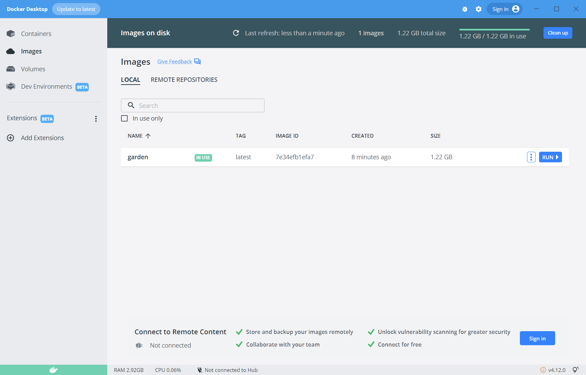
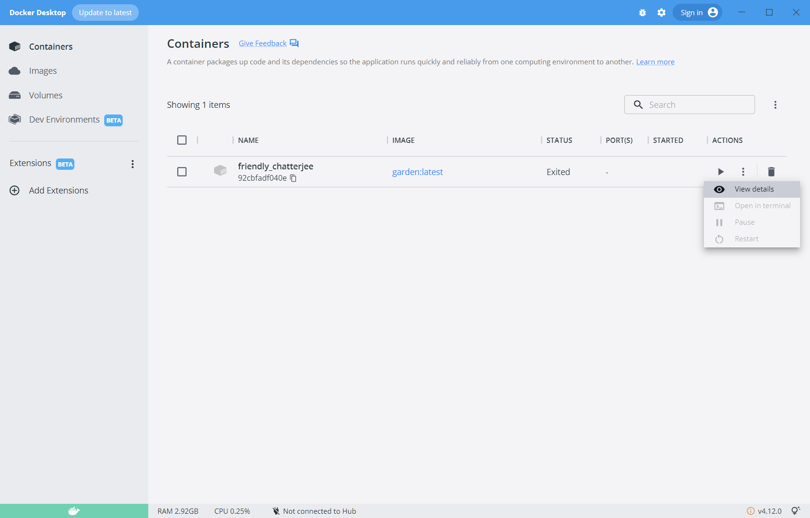

How to run this program in docker?
1. Build an image from the provided dockerfile using the below command
   docker build --tag semantic .
2. Run image in docker using Docker Desktop 

3. The output can be found by viewing container details in Containers tab

